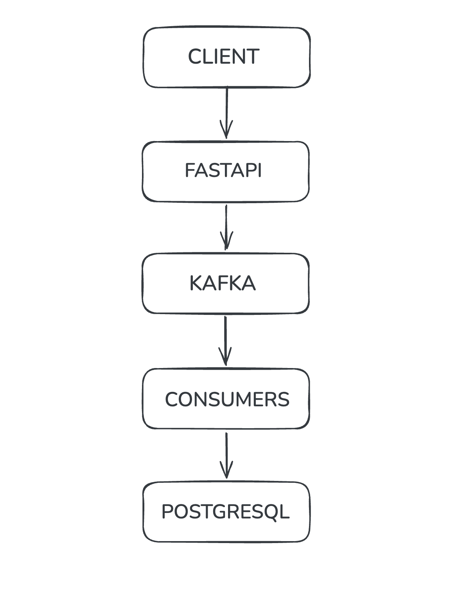
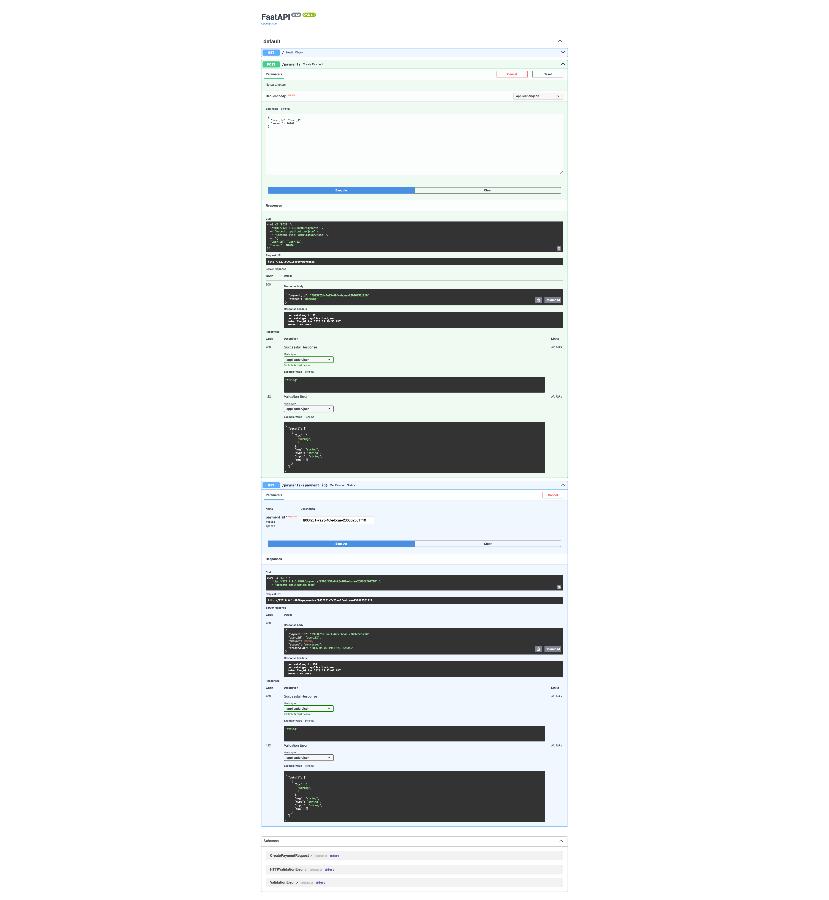
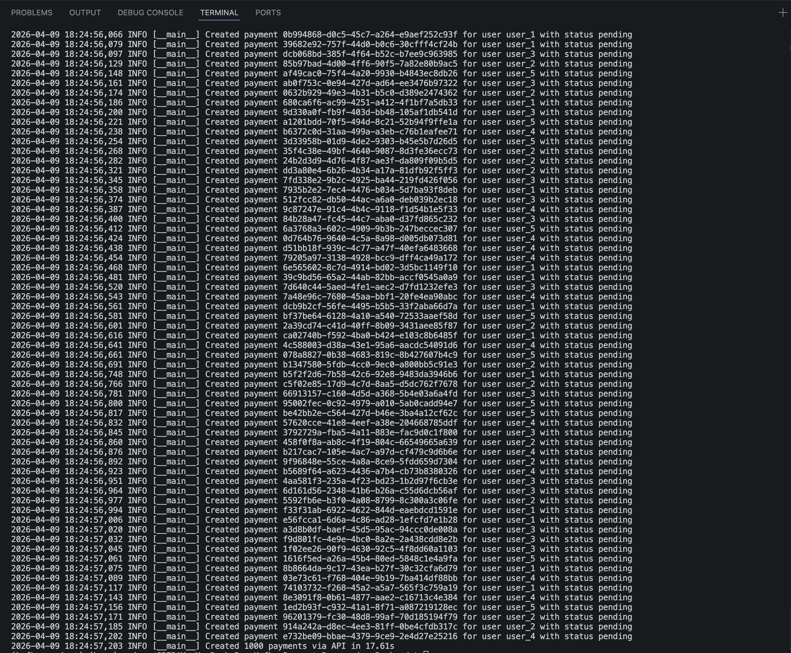
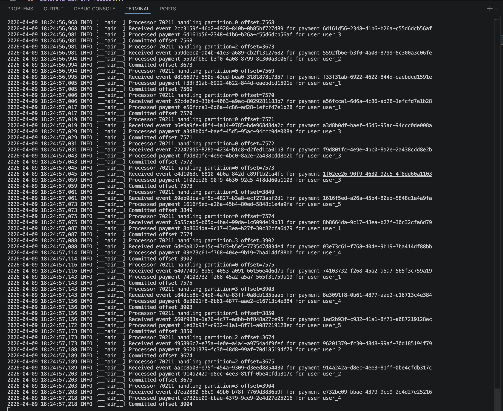
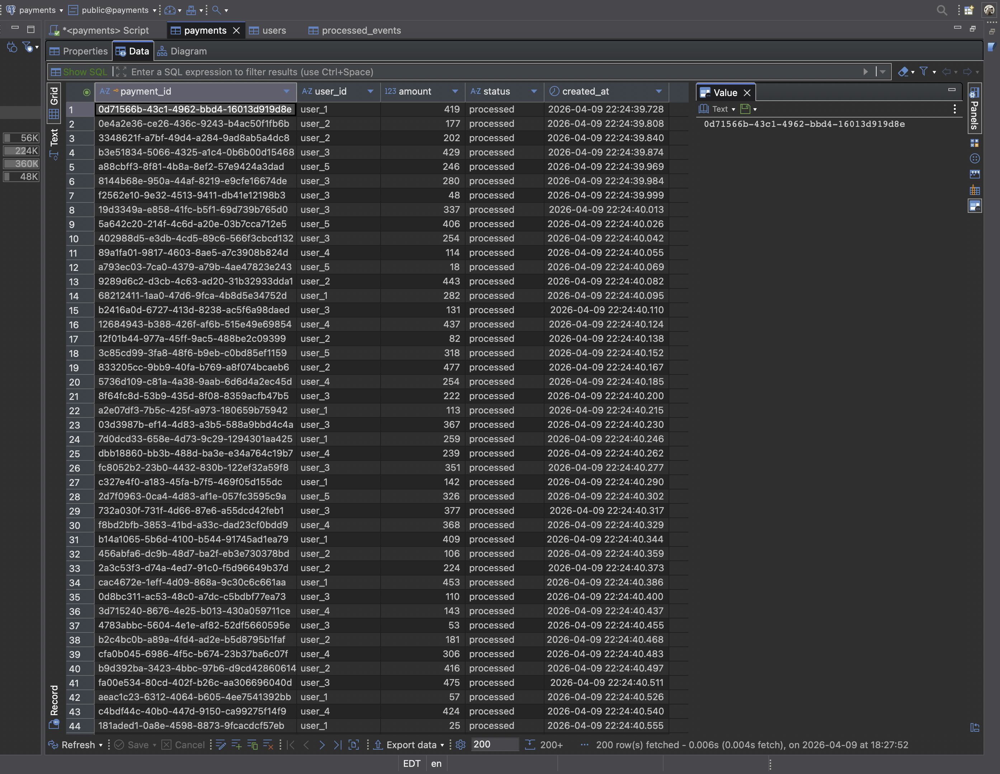

# Real-Time Event-Driven Payment Processing Backend

A backend systems project that models how modern payment platforms process transactions asynchronously using FastAPI, Apache Kafka, and PostgreSQL.

Instead of tightly coupling request handling to database-heavy business logic, this project separates payment creation from payment processing through an event-driven architecture. The result is a system that is more scalable, fault-tolerant, and closer to real-world distributed payment backends.

## Architecture

```text
Client -> FastAPI -> Kafka -> Consumers -> PostgreSQL
                         |
                         v
                        DLQ
```

### High-Level Flow

```text
[Client]
   |
   v
[FastAPI API]
   |
   v
[Kafka Topic: payment-events]
   |
   v
[Payment Consumer]
   |
   v
[PostgreSQL]

On failure:
[Payment Consumer] -> [DLQ Topic: payment-events-dlq] -> [DLQ Consumer]
```

## Architecture Diagram



## Screenshots









## Key Features

- Event-driven payment workflow using FastAPI, Kafka, and PostgreSQL
- Idempotent event processing to prevent duplicate transaction handling
- Manual Kafka offset commits for safer delivery guarantees
- Dead Letter Queue (DLQ) for failed event handling and debugging
- Payment state machine with clear lifecycle transitions
- REST API for creating payments and checking payment status
- Partitioned Kafka topic setup for scalable message processing
- Configurable local environment with `.env`

## System Design Decisions

### Why Kafka?

Kafka is the backbone of the asynchronous workflow in this project.

- Decoupling: the API only creates the payment record and emits an event; the consumer handles the heavier processing separately.
- Scalability: multiple consumers can process messages in parallel as traffic grows.
- Durability: events are persisted in Kafka, which makes the flow more resilient than in-memory background processing.
- Replayability: Kafka allows failed or missed events to be reprocessed more safely during debugging or recovery.

### Why Manual Offsets?

This project disables Kafka auto-commit and commits offsets only after processing finishes.

- Prevent data loss: a message is acknowledged only after the business logic completes.
- Better failure handling: if processing fails, the event can be pushed to the DLQ before its offset is committed.
- More control: offset management stays aligned with application-level success or failure.

### Why Idempotency?

Distributed systems must assume duplicates can happen.

- Duplicate safety: the `processed_events` table ensures the same `event_id` is not processed twice.
- Consistent state: retries or duplicate deliveries do not double-charge or double-update records.
- Real-world readiness: idempotency is a core reliability pattern for payment systems and event-driven services.

## Payment Lifecycle

This project models payment processing as a simple state machine:

- `pending`: payment is created through the API and stored in PostgreSQL
- `processed`: payment event is consumed and applied successfully
- `failed`: processing hits a database or application error and the record is marked failed

## Project Structure

```text
api/                  FastAPI application and Kafka producer
consumer/             Payment consumer and DLQ consumer
db/                   PostgreSQL connection and schema
kafka/                Kafka topic setup
producer/             Load testing event producer
utils/                Logging configuration
config.py             Environment-based configuration
docker-compose.yml    Kafka and PostgreSQL services
```

## Tech Stack

- FastAPI
- Apache Kafka
- PostgreSQL
- Confluent Kafka Python client
- Psycopg2
- Docker Compose

## How to Run

### 1. Clone the repository

```bash
git clone <your-repo-url>
cd <your-repo-folder>
```

### 2. Configure environment variables

```bash
cp .env.example .env
```

Default local configuration:

```env
KAFKA_BOOTSTRAP_SERVERS=127.0.0.1:9092
KAFKA_PAYMENT_TOPIC=payment-events
KAFKA_DLQ_TOPIC=payment-events-dlq
KAFKA_CONSUMER_GROUP_ID=payment-processors
KAFKA_DLQ_CONSUMER_GROUP_ID=paymentdlq-processors
KAFKA_TOPIC_PARTITIONS=4
KAFKA_TOPIC_REPLICATION_FACTOR=1
DB_HOST=localhost
DB_PORT=5432
DB_NAME=payments
DB_USER=admin
DB_PASSWORD=admin
LOG_LEVEL=INFO
```

### 3. Start infrastructure services

```bash
docker-compose up -d
```

This starts:

- Kafka on `127.0.0.1:9092`
- PostgreSQL on `localhost:5432`

### 4. Install dependencies

```bash
python -m venv venv
source venv/bin/activate
pip install -r requirements.txt
```

### 5. Initialize the database schema

Run the SQL in `db/schema.sql` against the `payments` database.

Example:

```bash
psql -h localhost -U admin -d payments -f db/schema.sql
```

### 6. Create Kafka topics

```bash
python kafka/setup_topics.py
```

### 7. Start the API server

```bash
uvicorn api.main:app --reload
```

### 8. Start the payment consumer

```bash
python consumer/payment_consumer.py
```

### 9. Start the DLQ consumer

```bash
python consumer/dlq_consumer.py
```

## API Usage

FastAPI automatically exposes Swagger UI once the server is running:

- `http://127.0.0.1:8000/docs`

### POST `/payments`

Creates a new payment, stores it with status `pending`, and publishes a payment event to Kafka.

Request body:

```json
{
  "user_id": "user_123",
  "amount": 250
}
```

Example:

```bash
curl -X POST "http://127.0.0.1:8000/payments" \
  -H "Content-Type: application/json" \
  -d '{
    "user_id": "user_123",
    "amount": 250
  }'
```

Sample response:

```json
{
  "payment_id": "a3e9d728-7d34-4b56-b8d5-1c2a9bd8c101",
  "status": "pending"
}
```

### GET `/payments/{payment_id}`

Fetches the current status of a payment.

Example:

```bash
curl "http://127.0.0.1:8000/payments/<payment_id>"
```

Sample response:

```json
{
  "payment_id": "a3e9d728-7d34-4b56-b8d5-1c2a9bd8c101",
  "user_id": "user_123",
  "amount": 250,
  "status": "processed",
  "created_at": "2026-04-09T15:00:00"
}
```

## Sample Flow

1. Client sends a payment creation request to `POST /payments`
2. FastAPI stores the payment in PostgreSQL with status `pending`
3. The API publishes a payment event to Kafka
4. The payment consumer reads the event from Kafka
5. The consumer checks idempotency using the `processed_events` table
6. The consumer updates business data and marks the payment as `processed`
7. If processing fails, the event is forwarded to the DLQ for inspection

## Failure Handling and DLQ

If a message cannot be processed successfully:

- the payment is marked as `failed` when appropriate
- the original event and error details are published to the DLQ topic
- the DLQ consumer can be used to inspect failed messages separately

This pattern keeps the main stream moving while preserving failed events for debugging and recovery workflows.

## Load Testing

The repository also includes a simple event producer for bulk simulation:

```bash
python producer/load_test_producer.py
```

This sends 1000 payment-like events into Kafka to test throughput and consumer behavior.

## Why This Project Stands Out

This is not just a CRUD backend.

- It demonstrates asynchronous system design
- It models real-world backend reliability concerns
- It applies event-driven patterns used in production systems
- It includes DLQ handling, idempotency, and controlled Kafka acknowledgments
- It shows how REST APIs and streaming systems work together in a payment pipeline

## Future Improvements

- Integrate a payment gateway simulator to validate user balances and model external dependency behavior during transaction processing
- Add configurable retry logic with exponential backoff before routing failed events to the Dead Letter Queue
- Deploy the API and consumer services independently with container orchestration to simulate a distributed microservices environment
- Add structured logging, Prometheus metrics, and OpenTelemetry tracing for stronger observability and debugging
- Explore Kafka transactional producers and consumers to move closer to exactly-once processing guarantees
- Extend the API with authentication, rate limiting, and stronger request validation for production-grade security
- Introduce idempotency keys at the API layer to prevent duplicate payment creation during client retries

## Author

Built as a backend systems project focused on event-driven architecture, reliability, and scalable payment processing patterns.

## Let's Connect

If you'd like to discuss backend engineering, event-driven systems, AI or collaborate on similar projects, feel free to reach out.

- LinkedIn: [Your Name](https://www.linkedin.com/in/sriram-vivek/)
- Email: sriramv1202@gmail.com
