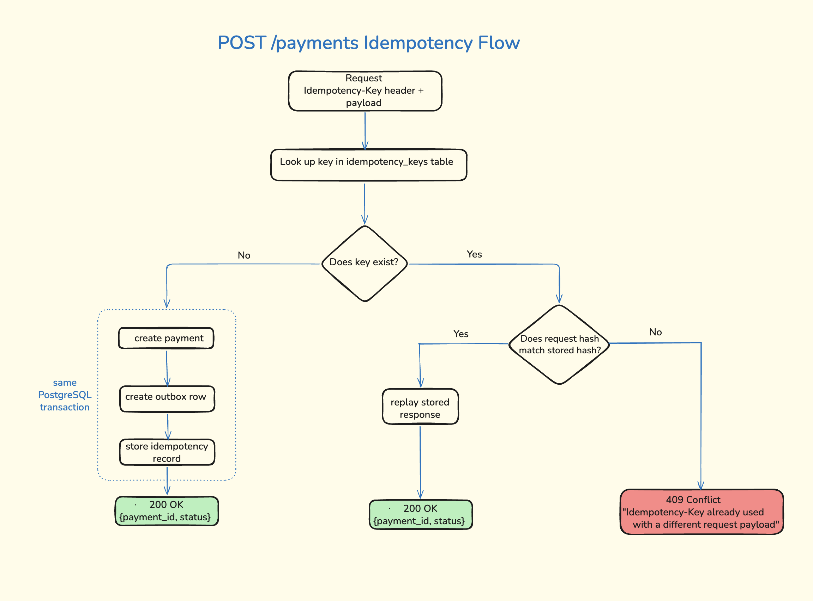

# Real-Time Event-Driven Payment Processing Backend

A payment processing backend built with FastAPI, Apache Kafka, and PostgreSQL, focused on reliability problems that appear in event-driven systems.

The project started as a simple asynchronous payment pipeline and has since been extended to explore failure handling, consumer idempotency, the PostgreSQL-to-Kafka dual-write problem, the transactional outbox pattern, API idempotency, and concurrency safety.

The current design uses PostgreSQL as the source of durable payment state and publication intent, while Kafka handles asynchronous payment processing.

## Tech Stack

- Python
- FastAPI
- Apache Kafka
- PostgreSQL
- Confluent Kafka Python client
- Psycopg2
- Docker Compose
- Pytest
- Ruff
- GitHub Actions

## Current Architecture

```text
                         PostgreSQL
                      ┌─────────────────┐
                      │ payments        │
Client                │ outbox          │
  │                   │ idempotency_keys│
  │                   └─────────────────┘
  │                           ▲
  ▼                           │
FastAPI ───── single DB transaction
  │
  │ payment + outbox + idempotency record
  │
  ▼
PostgreSQL
  │
  │ unpublished outbox rows
  ▼
Outbox Relay
  │
  ▼
Kafka: payment-events
  │
  ▼
Payment Consumer
  │
  ├── processed_events idempotency check
  ├── update payment state
  ├── update user balance
  └── commit Kafka offset after processing

On processing failure:

Payment Consumer
      │
      ▼
payment-events-dlq
      │
      ▼
DLQ Consumer
```

The API does not publish payment events directly to Kafka.

Instead, payment state and the corresponding event are written to PostgreSQL atomically. A separate outbox relay later publishes the event to Kafka.

This removes the failure window where a payment could commit successfully but its Kafka event could be permanently lost.

## Project Structure

```text
api/
    main.py                 FastAPI payment endpoints and API idempotency
    models.py               Request validation
    producer.py             Kafka producer used by the outbox relay

consumer/
    payment_consumer.py     Payment event processing
    dlq_consumer.py         Dead Letter Queue inspection

db/
    connection.py           PostgreSQL connection helper
    schema.sql              Database schema

kafka/
    setup_topics.py         Kafka topic creation

producer/
    load_test_producer.py   API load generation

tests/
    unit/                   Unit tests
    integration/            Database, Kafka, crash, idempotency and concurrency tests
    e2e/                    Reserved for end-to-end tests

docs/
    adr/                    Architecture Decision Records
    postmortems/            Failure reproduction and analysis

outbox_relay.py             Publishes durable outbox events to Kafka
idempotency_cleanup.py      Removes expired API idempotency records
config.py                   Environment-based configuration
docker-compose.yml          Kafka and PostgreSQL infrastructure
```

## Payment Creation Flow

A new payment request follows this flow:

```text
Client
  │
  │ POST /payments
  │ Idempotency-Key header
  ▼
FastAPI
  │
  ├── canonicalize request payload
  ├── compute SHA-256 request hash
  └── look up idempotency key
          │
          ├── existing key + same hash
          │       └── replay stored response
          │
          ├── existing key + different hash
          │       └── 409 Conflict
          │
          └── new key
                  │
                  ▼
          single PostgreSQL transaction
                  │
                  ├── create payment
                  ├── create outbox event
                  └── store idempotency record
```

The payment initially has status `pending`.

The outbox relay later publishes the event to Kafka, and the payment consumer performs the asynchronous processing.

## API Idempotency

Every `POST /payments` request requires a client-generated `Idempotency-Key` header.

The API stores:

- idempotency key
- SHA-256 request hash
- payment ID
- serialized response body
- creation time
- expiration time

The behavior is:

```text
new key
    → create payment
    → return response

same key + same request
    → replay stored response

same key + different request
    → 409 Conflict
```



### Concurrency Safety

An application-level check alone is not enough when multiple requests arrive concurrently.

Two requests can both observe that a key does not exist before either one commits.

The database therefore enforces:

```sql
idempotency_key TEXT NOT NULL UNIQUE
```

If concurrent requests race for the same key, one transaction commits successfully.

The losing transaction receives a PostgreSQL uniqueness violation, rolls back its candidate payment and outbox writes, reads the already committed idempotency record, and replays the stored response.

A concurrency integration test verifies that 10 simultaneous requests with the same key and payload result in:

```text
10 successful HTTP responses
1 payment
1 outbox row
1 idempotency record
```

## Idempotency Retention

Idempotency records are retained for at least 24 hours.

A background cleanup worker removes expired rows in batches.

```text
idempotency_cleanup.py
        │
        ▼
find rows where expires_at <= now
        │
        ▼
lock batch with FOR UPDATE SKIP LOCKED
        │
        ▼
delete expired records
```

Cleanup uses an index on `expires_at` so PostgreSQL can efficiently locate old records as the table grows.

The worker deletes up to 1,000 records per batch and continues immediately while a full backlog remains.

## Transactional Outbox

The original API performed:

```text
commit payment to PostgreSQL
        ↓
publish event to Kafka
```

A process crash between those operations could leave a committed payment with no Kafka event.

That failure was reproduced with an integration test before changing the architecture.

The current flow is:

```text
PostgreSQL transaction
    │
    ├── insert payment
    └── insert outbox event
    │
    ▼
commit
```

A separate relay polls:

```sql
WHERE published_at IS NULL
ORDER BY id
LIMIT 1
FOR UPDATE SKIP LOCKED
```

After successful Kafka delivery, the relay sets `published_at`.

If Kafka publication fails, the database transaction is rolled back and the outbox row remains unpublished so it can be retried.

## Delivery Semantics

The outbox provides **at-least-once publication**.

A relay can experience:

```text
publish event to Kafka
        ↓
Kafka acknowledges delivery
        ↓
relay crashes before published_at commits
        ↓
same outbox event is published again
```

This means duplicate Kafka records are possible.

The consumer therefore performs its own idempotency check using `event_id` in the `processed_events` table.

```text
Kafka event
    │
    ▼
INSERT event_id into processed_events
    │
    ├── already exists → skip duplicate
    │
    └── new event → apply business changes
```

This prevents duplicate publication from applying the payment side effect twice.

## Kafka Consumer Processing

The payment consumer:

1. reads an event from `payment-events`
2. checks `event_id` against `processed_events`
3. skips already processed events
4. creates the user record if needed
5. updates the user's balance
6. transitions the payment from `pending` to `processed`
7. commits the PostgreSQL transaction
8. manually commits the Kafka offset

Kafka auto-commit is disabled.

Offsets are committed only after application processing has completed.

## Failure Handling and DLQ

If payment processing raises a database error:

- database changes are rolled back
- the payment is marked `failed` when appropriate
- the original event and error context are published to `payment-events-dlq`
- the failed Kafka message offset is committed after the DLQ handoff

The DLQ payload includes:

- original event
- error message
- failure timestamp
- Kafka partition
- Kafka offset

A separate DLQ consumer can inspect failed events.

## API Usage

FastAPI exposes Swagger UI at:

```text
http://127.0.0.1:8000/docs
```

### POST `/payments`

Creates a logical payment request.

A client-generated `Idempotency-Key` header is required.

Request:

```bash
curl -X POST "http://127.0.0.1:8000/payments" \
  -H "Content-Type: application/json" \
  -H "Idempotency-Key: 9cb3faae-1dd4-4f35-a5d4-5d8f402f15c7" \
  -d '{
    "user_id": "user_123",
    "amount": 250
  }'
```

Response:

```json
{
  "payment_id": "a3e9d728-7d34-4b56-b8d5-1c2a9bd8c101",
  "status": "pending"
}
```

Repeating the same request with the same `Idempotency-Key` returns the stored response without creating another payment.

Using the same key with a different request payload returns:

```text
409 Conflict
```

### GET `/payments/{payment_id}`

Returns the current payment state.

```bash
curl "http://127.0.0.1:8000/payments/<payment_id>"
```

Example:

```json
{
  "payment_id": "a3e9d728-7d34-4b56-b8d5-1c2a9bd8c101",
  "user_id": "user_123",
  "amount": 250,
  "status": "processed",
  "created_at": "2026-04-09T15:00:00"
}
```

## How to Run

### 1. Clone the repository

```bash
git clone https://github.com/SriramV1212/Real-Time-Event-Driven-Payment-Processing-Backend.git
cd Real-Time-Event-Driven-Payment-Processing-Backend
```

### 2. Configure environment variables

```bash
cp .env.example .env
```

Default local configuration:

```env
KAFKA_BOOTSTRAP_SERVERS=127.0.0.1:9092
KAFKA_PAYMENT_TOPIC=payment-events
KAFKA_DLQ_TOPIC=payment-events-dlq
KAFKA_CONSUMER_GROUP_ID=payment-processors
KAFKA_DLQ_CONSUMER_GROUP_ID=paymentdlq-processors
KAFKA_TOPIC_PARTITIONS=4
KAFKA_TOPIC_REPLICATION_FACTOR=1

DB_HOST=localhost
DB_PORT=5432
DB_NAME=payments
DB_USER=admin
DB_PASSWORD=admin

LOG_LEVEL=INFO
```

### 3. Start Kafka and PostgreSQL

```bash
docker-compose up -d
```

Docker Compose starts the infrastructure services only:

- Kafka
- PostgreSQL

The application processes are started separately.

### 4. Install dependencies

```bash
python -m venv venv
source venv/bin/activate

pip install -r requirements.txt
pip install -r requirements-dev.txt
```

### 5. Initialize PostgreSQL

```bash
psql -h localhost -U admin -d payments -f db/schema.sql
```

### 6. Create Kafka topics

```bash
python kafka/setup_topics.py
```

### 7. Start the API

```bash
uvicorn api.main:app --reload
```

### 8. Start the outbox relay

```bash
python outbox_relay.py
```

### 9. Start the payment consumer

```bash
python consumer/payment_consumer.py
```

### 10. Start the DLQ consumer

```bash
python consumer/dlq_consumer.py
```

### 11. Start idempotency cleanup

```bash
python idempotency_cleanup.py
```

## Testing

The repository contains unit and integration tests for both normal behavior and failure scenarios.

Run linting:

```bash
ruff check .
```

Run all tests:

```bash
python -m pytest -s -v
```

Integration coverage includes:

- API idempotency response replay
- idempotency-key payload conflicts
- concurrent duplicate payment requests
- expired idempotency-key cleanup
- PostgreSQL-to-Kafka crash recovery
- Kafka publication failure and retry
- relay crash after successful Kafka publication
- duplicate consumer-event handling
- outbox observability

GitHub Actions currently runs Ruff and the unit-test suite on pushes and pull requests.

## Failure-Oriented Integration Testing

Several reliability mechanisms in this project were built by first reproducing the failure they were intended to solve.

Examples include:

### PostgreSQL-to-Kafka Dual-Write Failure

A test terminates the API process after the PostgreSQL commit to reproduce the original lost-event window.

The transactional outbox changes the outcome so the publication obligation remains durable after the API crashes.

### Relay Crash After Kafka Publication

A test crashes the relay after Kafka acknowledges an event but before `published_at` is committed.

This demonstrates why the architecture is at-least-once and why consumer idempotency is required.

### API Idempotency Race

A concurrency test sends multiple requests with the same idempotency key while widening the check-then-insert race window.

The database `UNIQUE` constraint ensures only one logical payment commits.

## Load Testing

The load-test script sends 1,000 payment creation requests through the FastAPI endpoint.

```bash
python producer/load_test_producer.py
```

Each generated payment uses a new UUID idempotency key.

Earlier consumer scaling tests using the partitioned Kafka topic measured:

```text
1 consumer  → 16.11s
3 consumers →  8.03s
4 consumers →  6.73s
```

These measurements were taken from a 1,000-event local test and are not intended as production benchmarks.

## Architecture Decisions

Detailed design decisions are recorded in `docs/adr/`.

### ADR 001: Transactional Outbox for Payment Events

Documents why the API moved from direct PostgreSQL + Kafka dual writes to a transactional outbox and polling relay.

### ADR 002: API Idempotency and Concurrency Safety

Documents the API idempotency model, database uniqueness guarantee, response replay behavior, retention policy, cleanup design, and tradeoffs.

## Postmortems

Failure reproductions and their fixes are recorded in `docs/postmortems/`.

### PostgreSQL-to-Kafka Dual-Write Failure

Documents the original dual-write failure, deterministic crash reproduction, transactional-outbox resolution, and the duplicate-publication failure mode introduced by at-least-once delivery.

### API Idempotency Race Under Concurrent Requests

Documents the check-then-act race, deterministic concurrency reproduction, database-level uniqueness fix, and retention considerations.

## Key Reliability Properties

### API Idempotency

A client-generated idempotency key identifies one logical payment request.

### Atomic Payment Creation

The payment, outbox event, and idempotency record are committed in one PostgreSQL transaction.

### Durable Event Publication

A committed payment carries a durable outbox record that can be published later if Kafka is temporarily unavailable.

### At-Least-Once Event Delivery

Duplicate Kafka events are possible and expected under some relay crash conditions.

### Consumer Idempotency

`processed_events.event_id` protects business state from duplicate event processing.

### Manual Kafka Offset Management

Offsets are committed after processing rather than automatically.

### Dead Letter Queue

Processing failures retain the original event and error context for inspection.

### Concurrency-Safe API Idempotency

A PostgreSQL uniqueness constraint prevents concurrent requests from creating multiple committed idempotency records for one key.

## Current Limitations

This project intentionally leaves several areas open for further work:

- user balances use a simplified direct balance update rather than an accounting ledger
- the outbox relay processes one row at a time
- Kafka publication currently uses synchronous `flush()`
- relay retry behavior does not yet use exponential backoff or retry scheduling
- published outbox rows do not yet have a retention/cleanup policy
- the DLQ publish and Kafka offset commit are not one atomic operation
- strict global event publication ordering is not guaranteed with concurrent relay workers
- idempotency protection is bounded by the retention period
- observability is currently limited compared with a deployed production system

## Next: Double-Entry Ledger

The current consumer directly modifies a user's balance when processing a payment.

The next extension replaces direct balance mutation with a double-entry ledger.

Instead of treating a balance as the primary source of truth, each movement of funds will create balanced ledger entries. Account balances can then be derived from those entries, making money movement easier to trace, audit, and reconcile.

## Future Improvements

- build the double-entry ledger and ledger accounts
- add balance invariants and ledger reconciliation
- add outbox retention and cleanup
- add configurable retry scheduling and exponential backoff
- export application and outbox metrics to Prometheus
- add OpenTelemetry tracing across API, relay, Kafka, and consumer flows
- containerize and deploy application processes independently
- add authentication, authorization, and rate limiting
- improve DLQ recovery and replay workflows
- evaluate CDC/Debezium as an alternative to polling the outbox at higher scale

## Documentation

Architecture decisions:

```text
docs/adr/001-transactional-outbox.md
docs/adr/002-api-idempotency.md
```

Failure analysis:

```text
docs/postmortems/dual-write-failure.md
docs/postmortems/api-idempotency-race.md
```

## Let's Connect

If you'd like to discuss backend engineering, distributed systems, payments, or event-driven architecture:

- LinkedIn: [Sriram Vivek](https://www.linkedin.com/in/sriram-vivek/)
- Email: sriramv1202@gmail.com